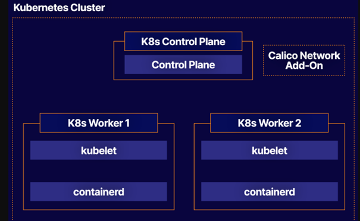

# Building a Kubernetes 1.24 Cluster with kubeadm

 This project helps users to start a cluster with tree nodes (1 master and 2 worker nodes).

 


## Deployment

Execute the following commands on all the nodes(both control and worker) 

```
cat <<EOF | sudo tee /etc/modules-load.d/k8s.conf
overlay
br_netfilter
EOF

sudo modprobe overlay
sudo modprobe br_netfilter

# sysctl params required by setup, params persist across reboots
cat <<EOF | sudo tee /etc/sysctl.d/k8s.conf
net.bridge.bridge-nf-call-iptables  = 1
net.bridge.bridge-nf-call-ip6tables = 1
net.ipv4.ip_forward                 = 1
EOF

# Apply sysctl params without reboot
sudo sysctl --system

sudo apt-get update && sudo apt-get install -y containerd.io 
sudo mkdir -p /etc/containerd 
sudo containerd config default | sudo tee /etc/containerd/config.toml 
sudo systemctl restart containerd 
sudo systemctl status containerd 

# Disable swap:
sudo swapoff -a 
sudo apt-get update && sudo apt-get install -y apt-transport-https curl 

# Download and add GPG key:
curl -s https://packages.cloud.google.com/apt/doc/apt-key.gpg | sudo apt-key add - 

# Add Kubernetes to repository liscat <<EOF | sudo tee /etc/apt/sources.list.d/kubernetes.list deb 
https://apt.kubernetes.io/ kubernetes-xenial main 
EOF 

sudo apt-get update
sudo apt-get install -y kubelet=1.24.0-00 kubeadm=1.24.0-00 kubectl=1.24.0-00

# Turn off automatic updates
sudo apt-mark hold kubelet kubeadm kubectl 
```
Initialize the Cluster
```
# This is only performed on the Control Plane Node):

sudo kubeadm init --pod-network-cidr 192.168.0.0/16 --kubernetes-version 1.24.0
mkdir -p $HOME/.kube sudo cp -i /etc/kubernetes/admin.conf $HOME/.kube/config sudo chown $(id -u):$(id -g) $HOME/.kube/config
kubectl get nodes
```
Install the Calico Network Add-On
```
# On the control plane node, install Calico Networking:

kubectl apply -f https://docs.projectcalico.org/manifests/calico.yaml

kubectl get nodes
```

Join the Worker Nodes to the Cluster
```
#In the control plane node, create the token and copy the kubeadm join command (NOTE:The join command can also be found in the output from kubeadm init command):
kubeadm token create --print-join-command

# In both worker nodes, paste the kubeadm join command to join the cluster. Use sudo to run it as root:
sudo kubeadm join ...

#In the control plane node, view cluster status (Note: You may have to wait a few moments to allow all nodes to become ready):
kubectl get nodes
```

